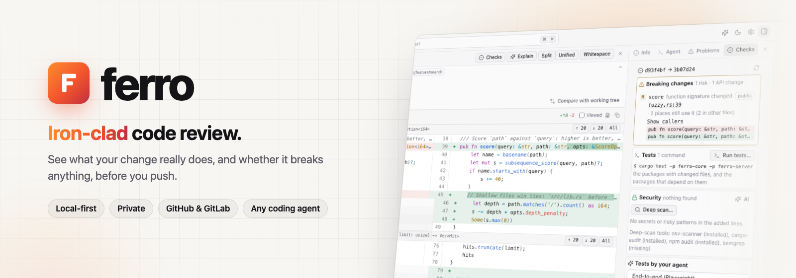
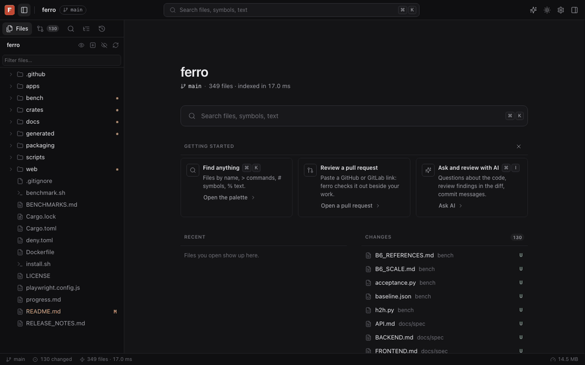
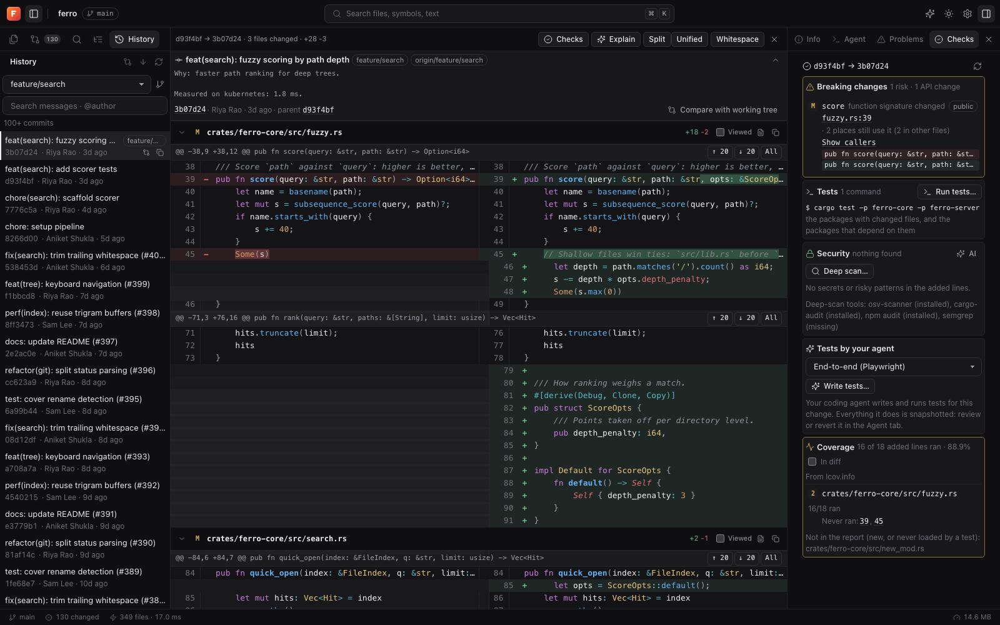
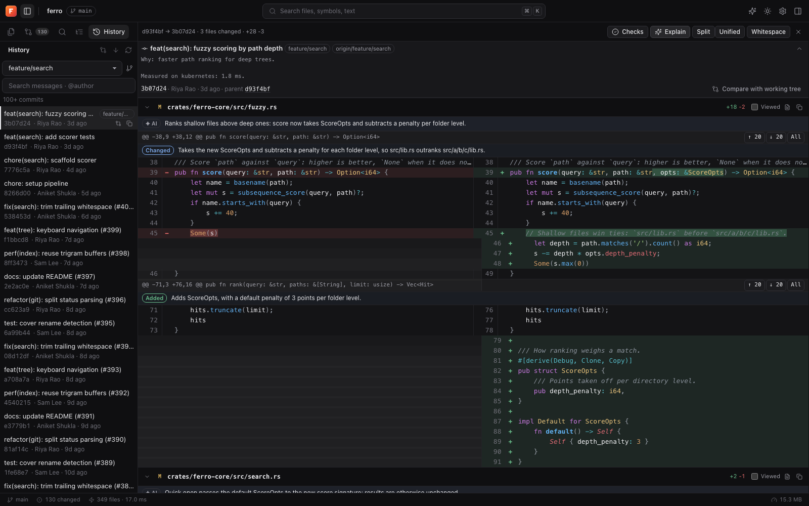
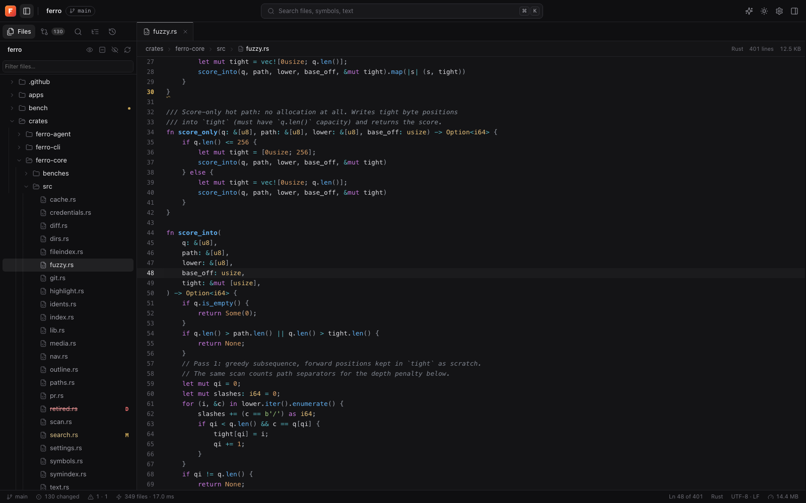
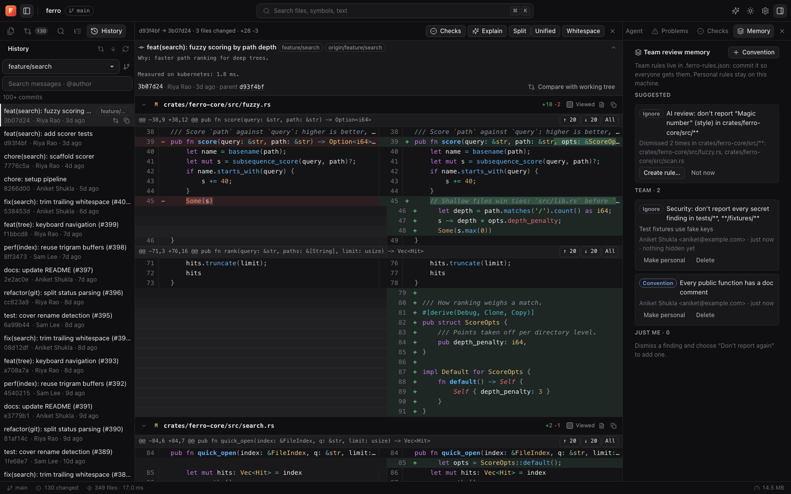
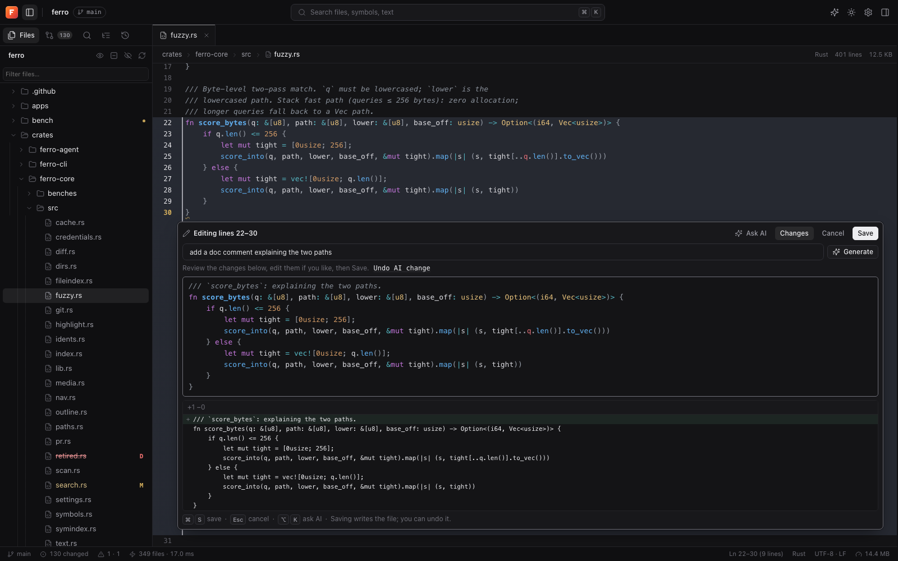
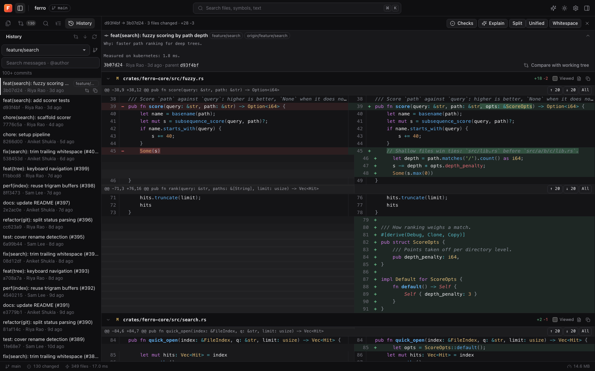

<p align="center">
  <picture>
    <source media="(prefers-color-scheme: dark)" srcset="docs/assets/banner-dark.png">
    
  </picture>
</p>

<p align="center">
  <a href="https://aniketshukla1.github.io/ferro/"><strong>Live demo</strong></a> &middot;
  <a href="#-quickstart"><strong>Quickstart</strong></a> &middot;
  <a href="#-features"><strong>Features</strong></a> &middot;
  <a href="docs/DEVELOPING.md"><strong>Docs</strong></a> &middot;
  <a href="https://github.com/aniketshukla1/ferro/issues"><strong>Issues</strong></a>
</p>

<p align="center">
  <a href="LICENSE"></a>
  <a href="https://github.com/aniketshukla1/ferro/stargazers"></a>
  <a href="https://github.com/aniketshukla1/ferro/actions/workflows/ci.yml"></a>
  
  
  <a href="https://aniketshukla1.github.io/ferro/"></a>
</p>

<br/>

<p align="center">
  <a href="https://aniketshukla1.github.io/ferro/">
    
  </a>
</p>

<p align="center">
  <a href="https://aniketshukla1.github.io/ferro/"></a>
</p>

<br/>

# ferro checks what your change breaks, before you push.

A fast, private, keyboard-first workspace for **reading, checking and reviewing code** on your own machine.

**GitHub reviews what you pushed. ferro reviews what you're about to push.**

Open any folder or pull request and ferro shows you the change the way an expert reviewer sees it: what it does, which callers it breaks, which tests cover it, whether it leaks a secret, and which new lines never ran. Bring your own AI and your own coding agent if you want help. Nothing leaves your computer unless you ask.

|        | Step | Example |
| ------ | ---- | ------- |
| **01** | **Open** | `ferro .`, or paste a GitHub / GitLab pull request link. Big repos open in milliseconds. |
| **02** | **Check** | One click: breaking changes, the tests that cover it, security, coverage of the new lines. |
| **03** | **Ship** | Commit, push or submit your review, knowing exactly what the change does. |

<br/>

<div align="center">
<table>
  <tr>
    <td align="center"><strong>Works<br/>with</strong></td>
    <td align="center"><br/><sub>GitHub</sub></td>
    <td align="center"><br/><sub>GitLab</sub></td>
    <td align="center"><br/><sub>Claude Code</sub></td>
    <td align="center"><br/><sub>Codex</sub></td>
    <td align="center"><br/><sub>Gemini</sub></td>
    <td align="center"><br/><sub>Cursor</sub></td>
    <td align="center"><br/><sub>Ollama</sub></td>
  </tr>
  <tr>
    <td align="center"><strong>Knows</strong></td>
    <td align="center"><br/><sub>Rust</sub></td>
    <td align="center"><br/><sub>Go</sub></td>
    <td align="center"><br/><sub>TypeScript</sub></td>
    <td align="center"><br/><sub>JavaScript</sub></td>
    <td align="center"><br/><sub>Python</sub></td>
    <td align="center"><sub>Java · C<br/>Ruby · PHP</sub></td>
    <td align="center"><sub>+ any text<br/>file</sub></td>
  </tr>
</table>

<em>Any forge, any agent, any language. Your machine, your rules.</em>

</div>

<br/>

## ferro is right for you if

- ✅ You want to know **what a change breaks** before CI, a reviewer or your users find out
- ✅ You review **pull requests on GitHub or GitLab** (including self-hosted) and want it to be fast and pleasant
- ✅ You use **coding agents** (Claude Code, Codex, Gemini, Cursor, Aider…) and want to review and undo what they did, hunk by hunk
- ✅ You work in **big repositories** where every tool feels slow
- ✅ Your code is **private** and must not be uploaded anywhere
- ✅ Your team keeps making the **same review comments**, and you want them remembered

<br/>

## ✨ Features

<table>
<tr>
<td align="center" width="33%">
<h3>🛡️ Checks before you push</h3>
Breaking changes with their callers, the tests that cover your change, secrets and risky code, coverage of new lines. One click.
</td>
<td align="center" width="33%">
<h3>⚡ Instant, even on huge repos</h3>
60,000-file trees, 400,000-line files, search across everything in milliseconds. No upload, no waiting.
</td>
<td align="center" width="33%">
<h3>🔍 Understand any change</h3>
Word-level diffs, IDE colors, go to definition and references. <b>Explain</b> tags every changed block with what it does.
</td>
</tr>
<tr>
<td align="center">
<h3>🕰️ History & compare</h3>
Every commit on every branch. Compare any two points in time, or any commit against your current files.
</td>
<td align="center">
<h3>🤝 Pull request review</h3>
GitHub and GitLab PRs: comments, suggestions, "changed since my last review", AI findings in the diff.
</td>
<td align="center">
<h3>✏️ Fix it where you see it</h3>
Select lines and type, or tell the AI what to change and check its diff. Bigger jobs go to Claude Code, Codex and friends. Every save can be undone.
</td>
</tr>
<tr>
<td align="center">
<h3>🧠 Team review memory</h3>
Dismiss a finding once and choose "don't report again". Rules and conventions are shared through git.
</td>
<td align="center">
<h3>🔒 Private by design</h3>
Runs on your machine. No telemetry, no account. AI is optional and only sees what you send it.
</td>
<td align="center">
<h3>⌨️ Keyboard-first</h3>
<kbd>⌘</kbd><kbd>K</kbd> finds anything. Every action has a shortcut. Vim keys if you like them. 16 themes.
</td>
</tr>
</table>

<br/>

## 📸 A closer look

<table>
<tr>
<td width="50%"><p align="center"><sub><b>Checks</b>: what this commit breaks, which tests cover it, is it safe</sub></p></td>
<td width="50%"><p align="center"><sub><b>Explain</b>: every change tagged Added / Removed / Changed, in plain words</sub></p></td>
</tr>
<tr>
<td width="50%"><p align="center"><sub><b>Read</b>: IDE colors, definitions and references, instantly</sub></p></td>
<td width="50%"><p align="center"><sub><b>Memory</b>: rules your whole team shares through git</sub></p></td>
</tr>
<tr>
<td width="50%"><p align="center"><sub><b>Edit</b>: fix lines in place, typed or AI-written, with a diff before you save</sub></p></td>
<td width="50%"><p align="center"><sub><b>History</b>: any commit on any branch, compared with anything</sub></p></td>
</tr>
</table>

<br/>

## Problems ferro solves

| Without ferro | With ferro |
| --- | --- |
| ❌ You rename a function, push, and CI (or a user) finds the three callers you missed. | ✅ **Breaking changes** lists every removed or re-signatured function and the places that still use it, before you push. |
| ❌ You run the whole test suite for a two-line change, or skip tests entirely. | ✅ **Tests** runs only the tests your change touches, and links each failure to its line. |
| ❌ A token slips into a commit and you rotate keys at midnight. | ✅ **Security** flags secrets and risky code in the lines you added, offline, before they leave your machine. |
| ❌ You spot a one-line fix mid-review, switch to your editor, hunt for the file and lose your place. | ✅ **Edit in place**: select the lines and type, or ask the AI and check its diff. Save writes the file; one click undoes it. |
| ❌ Your coding agent edited twelve files and you have no idea what it really did. | ✅ ferro snapshots before the agent runs; **Explain** tags every change, and you keep or revert hunk by hunk. |
| ❌ Reviewing a big PR means waiting on a slow web page, file by file. | ✅ The whole PR opens locally in milliseconds, with your comments, threads and AI findings inline. |
| ❌ Your team leaves the same "don't worry about this" comment every week. | ✅ **Team memory** turns a dismissal into a shared rule, so the tools stop nagging. |

<br/>

## Why ferro is fast

Measured on an M1 Pro against the Kubernetes and TypeScript repositories:

| | |
| --- | --- |
| **Index 31,000 files** | 370 ms |
| **Search a 67,000-file repo** (no match, the worst case) | 9 ms |
| **Open a huge file** (first 1,000 highlighted lines) | 2–4 ms |
| **Find all references** of a symbol | ≤ 2 ms |
| **Memory while idle** (Kubernetes open) | ~43 MB |
| **Install size** | one ~23 MB binary, no runtime |

A Rust core with a trigram search index, tree-sitter symbols for 9 languages, and a UI with no build step and no framework.

<br/>

## What's under the hood

```
┌──────────────────────────────────────────────────────────────────┐
│                    ferro  (one local binary)                     │
│                                                                  │
│  ┌──────────┐  ┌──────────┐  ┌──────────┐  ┌──────────────────┐  │
│  │  Index & │  │ Symbols &│  │   Git:   │  │  Checks: radar,  │  │
│  │  trigram │  │ nav (tree│  │ history, │  │  tests, security,│  │
│  │  search  │  │ -sitter) │  │ diff, PR │  │  coverage        │  │
│  └──────────┘  └──────────┘  └──────────┘  └──────────────────┘  │
│  ┌──────────┐  ┌──────────┐  ┌──────────┐  ┌──────────────────┐  │
│  │ AI: ask, │  │  Agent   │  │  Team    │  │ Private link,    │  │
│  │ review,  │  │ harness, │  │  review  │  │ read-only, TLS,  │  │
│  │ explain  │  │ snapshots│  │  memory  │  │ audit log        │  │
│  └──────────┘  └──────────┘  └──────────┘  └──────────────────┘  │
└──────────────────────────────────────────────────────────────────┘
       ▲               ▲               ▲                ▲
  ┌────┴─────┐   ┌─────┴─────┐   ┌─────┴──────┐   ┌─────┴───────┐
  │ your repo│   │ GitHub /  │   │ AI provider│   │ your coding │
  │  & git   │   │  GitLab   │   │ (optional) │   │   agent     │
  └──────────┘   └───────────┘   └────────────┘   └─────────────┘
```

<br/>

## What ferro is not

| | |
| --- | --- |
| **Not a full IDE.** | Quick fixes happen in place, typed or AI-written, but keep writing code wherever you like. ferro is where you read, check and review, and it follows your edits live. |
| **Not a CI service.** | It runs the checks you'd wait on CI for, on your machine, before you push. Keep your CI. |
| **Not a hosted platform.** | No account, no upload, no telemetry. It's a program on your computer. |
| **Not tied to one AI.** | Bring any provider (or none), and any coding agent. |

<br/>

## 🚀 Quickstart

**Try it without installing:** open the **[live demo](https://aniketshukla1.github.io/ferro/)**. It runs entirely in your browser on sample data.

**Install** (you need [Rust](https://rustup.rs) and `git`):

```bash
git clone https://github.com/aniketshukla1/ferro.git
cd ferro
cargo install --path crates/ferro-cli --locked
```

A one-line installer arrives with the first release:

```bash
curl -fsSL https://raw.githubusercontent.com/aniketshukla1/ferro/main/install.sh | sh
```

**Open something:**

```bash
ferro                                        # the folder you're in
ferro ~/code/my-app                          # any folder
ferro src/server.rs:120                      # a file, at a line
ferro https://github.com/owner/repo/pull/42  # a pull request (GitHub or GitLab)
```

ferro prints a private link and opens it in your browser. Press <kbd>⌘</kbd><kbd>K</kbd> (<kbd>Ctrl</kbd><kbd>K</kbd> on Windows/Linux) and start typing: everything ferro can do is in there.

<details>
<summary><b>More ways to run it</b></summary>

```bash
ferro ssh me@server:/srv/app          # review code on a remote machine (installs and tunnels for you)
ferro --read-only                     # people can look, never change anything
ferro --tls self-signed               # serve over HTTPS on your network
ferro --base-path /ferro              # behind a reverse proxy at /ferro
ferro --help                          # every option
```

**Docker:** `docker build -t ferro . && docker run -p 7777:7777 -v "$(pwd):/src:ro" ferro`

**Desktop app:** a native app (same ferro inside) is on the way. You can build it today from `apps/desktop`; see [docs/DEVELOPING.md](docs/DEVELOPING.md).
</details>

<br/>

## 🤖 AI and coding agents (optional)

ferro works fully without AI. To turn it on, set one provider key in the shell you start ferro from:

```bash
export ANTHROPIC_API_KEY=...   # or OPENAI_API_KEY, or GEMINI_API_KEY
export OLLAMA_MODEL=llama3.1   # or stay fully local with Ollama
```

- **Ask AI** (<kbd>⌘</kbd><kbd>I</kbd>) about the code in front of you; answers cite exact lines.
- **AI review** reads a change like a careful colleague; findings land in the diff, and you accept, edit or dismiss each one.
- **Explain** tags every changed block with what it does.
- **Edit with AI** (<kbd>Alt</kbd><kbd>K</kbd>): select lines, say what to change, check the diff, save. No coding agent needed.
- Secrets are stripped before anything is sent; `.env`, keys and certificates are never sent at all.

For **coding agents**, install one (Claude Code, Codex, Gemini CLI, Cursor Agent, OpenCode, Aider, Goose…) and pick it the first time you open the **Agent** tab. <kbd>Alt</kbd><kbd>E</kbd> hands it a selection; **Fix N with agent** sends it all your review comments at once.

<br/>

## 🧩 From your editor

`ferro open file:line` opens a file (or `--view changes|checks|history|diff`) in the ferro already running for that folder, and starts one when none is. The **VS Code** extension (Open in ferro, Show Diff, Review Changes, Check This Change) and ready-made **JetBrains** and **Vim** setups are in [editors/](editors/README.md).

<br/>

## ⌨️ Handy shortcuts

| Do this | Press | | Do this | Press |
|---|---|---|---|---|
| Find anything | <kbd>⌘</kbd><kbd>K</kbd> | | Changes / diff | <kbd>⌘</kbd><kbd>⇧</kbd><kbd>G</kbd> / <kbd>⌘</kbd><kbd>D</kbd> |
| All commands | <kbd>⌘</kbd><kbd>⇧</kbd><kbd>P</kbd> | | History | <kbd>⌘</kbd><kbd>⇧</kbd><kbd>H</kbd> |
| Search the project | <kbd>⌘</kbd><kbd>⇧</kbd><kbd>F</kbd> | | Ask AI | <kbd>⌘</kbd><kbd>I</kbd> |
| Definition / references | <kbd>F12</kbd> / <kbd>⇧</kbd><kbd>F12</kbd> | | Edit with your agent | <kbd>Alt</kbd><kbd>E</kbd> |
| Edit lines in place | <kbd>Alt</kbd><kbd>I</kbd> | | Edit lines with AI | <kbd>Alt</kbd><kbd>K</kbd> |
| Go to line | <kbd>⌘</kbd><kbd>G</kbd> | | Every shortcut | <kbd>⌘</kbd><kbd>/</kbd> |

On Windows and Linux, use <kbd>Ctrl</kbd> where you see <kbd>⌘</kbd>.

<br/>

## 🔒 Your code, your machine

- **Private link.** Each start prints a link with a one-time key, so other sites and programs on your computer can't read your code through ferro. Your browser is remembered for 30 days.
- **Nothing phones home.** No telemetry, no accounts, no cloud.
- **Untrusted pull requests stay untrusted.** ferro won't run a PR's tests or language servers unless you allow it, and a PR can't add a team rule that hides its own problems.
- **Read-only mode** for sharing a screen or a server safely.

<br/>

## FAQ

**Does my code leave my computer?**
No, unless you use AI, and then only the parts you ask about go to the provider you chose (minus secrets). With Ollama, even that stays local.

**How is this different from GitHub or GitLab?**
They show a change after you push it, and their checks run on their servers minutes later. ferro works on the change you have right now, committed or not, in milliseconds, on your machine. It also works with both forges at once.

**Does it replace my editor?**
No. You can fix lines in place (type, or ask the AI), but ferro is for reading, checking and reviewing. Keep your editor; ferro follows your edits live.

**Which languages does it understand?**
Search, diffs, history and security checks work on any text. Definitions, references and breaking-change detection cover Rust, Go, TypeScript, JavaScript, Python, Java, C, Ruby and PHP.

**Do I need an account?**
No. Only to open pull requests from GitHub or GitLab, and then just your normal token.

<br/>

## Contributing

Bug reports and ideas are very welcome in [issues](https://github.com/aniketshukla1/ferro/issues). To build, test or hack on ferro, start with **[docs/DEVELOPING.md](docs/DEVELOPING.md)**.

## Community

- [GitHub Issues](https://github.com/aniketshukla1/ferro/issues): bugs and feature requests
- [Live demo](https://aniketshukla1.github.io/ferro/): try it in your browser
- ⭐ Star the repo to follow along

## License

MIT

## Star History

<a href="https://star-history.com/#aniketshukla1/ferro&Date">
  <picture>
    <source media="(prefers-color-scheme: dark)" srcset="https://api.star-history.com/svg?repos=aniketshukla1/ferro&type=Date&theme=dark">
    
  </picture>
</a>

<br/>

---

<p align="center">
  <sub>Open source under MIT. Built for people who want to ship with confidence, not hope.</sub>
</p>
